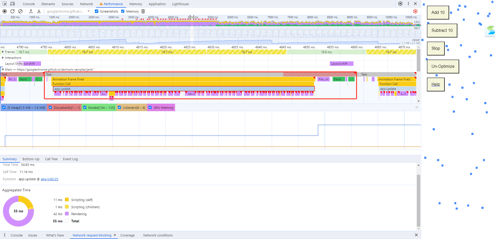
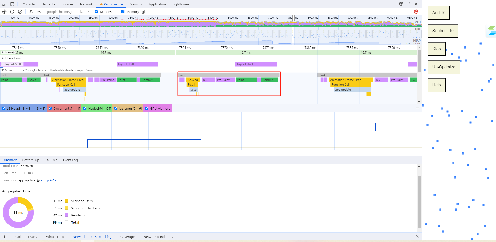
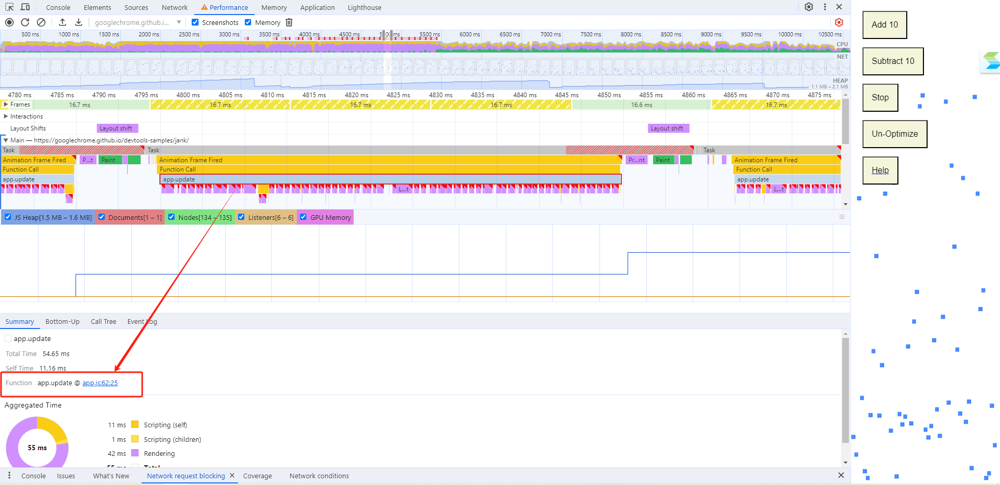
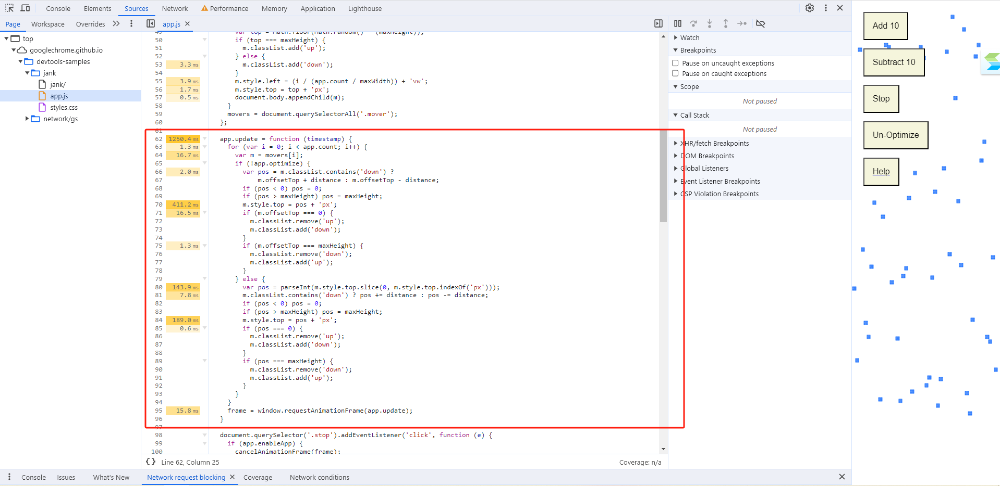

---
# 这是文章的标题
title: 浏览器渲染流程及优化
# 你可以自定义封面图片
# cover: /assets/images/cover1.jpg
# 这是页面的图标
icon: file
# 这是侧边栏的顺序
order: 1
# 设置作者
author: moonandcake
# 设置写作时间
date: 2023-12-06
# 一个页面可以有多个分类
# category:
#   - 使用指南
# 一个页面可以有多个标签
# tag:
#   - 页面配置
#   - 使用指南
# 此页面会在文章列表置顶
sticky: false
# 此页面会出现在文章收藏中
star: true
# 你可以自定义页脚
footer:
# 你可以自定义版权信息
copyright:
---

<!-- `more` 注释之前的内容被视为文章摘要。 -->
<!-- Performance是Chrome浏览器自带的性能监测工具 -->

<!-- more -->

## 前言

从浏览器输入 URL 到整个页面渲染成功：

- 用户输入域名；
- 然后 DNS 解析成 IP 地址；
- 浏览器根据 IP 地址请求服务器；
- 服务器响应 http 请求，并返回给浏览器；
- 浏览器开始渲染；

前端工作者比较关心的是浏览器的渲染工作。

## 浏览器的渲染流程

<!-- Performance是Chrome浏览器自带的性能监测工具。根据我的使用，简单理解就是我们可以通过它录制一段时间的浏览器活动，通过活动的数据去分析页面是否存在提升的空间。想要获取页面的活动数据，那我们的第一步便是录制浏览器的活动。 -->

- 解析 HTML: 解析 HTML 并构建 DOM 树。
- 解析 CSS: 解析 CSS 构建 CSSOM 树（样式树）。
- 合成渲染树：将 DOM 与 CSSOM 合并成一个 渲染树（Render Tree） 。
- 布局计算：根据渲染树的结构，计算每个节点在屏幕上的大小、位置等属性，生成布局信息（Layout）。这个过程会发生回流和重绘。
- 绘制页面：将生成的布局信息交给浏览器的绘图引擎，通过 GPU 加速将像素绘制（Paint）到屏幕上。
- 浏览器回流和重绘：如果页面发生改变，浏览器需要重新计算布局和绘制，这可能会导致性能问题。因此我们应尽量避免频繁的 DOM 操作和调整元素样式，以减少不必要的回流和重绘。

### 注意

- DOM 解析和 CSS 解析是两个并行的进程，所以这也解释了为什么 CSS 加载不会阻塞 DOM 的解析。
- 然而，由于 Render Tree 是依赖于 DOM Tree 和 CSSOM Tree 的，所以他必须等待到 CSSOM Tree 构建完成，也就是 CSS 资源加载完成(或者 CSS 资源加载失败)后，才能开始渲染。因此，CSS 加载是会阻塞 Dom 的渲染的。
- 由于 js 可能会操作之前的 Dom 节点和 css 样式，因此浏览器会维持 html 中 css 和 js 的顺序。因此，样式表会在后面的 js 执行前先加载执行完毕。所以 css 会阻塞后面 js 的执行。

---

## 渲染过程中可能遇到的问题

1.CSS 阻塞

只有通过link引入的外部CSS才会产生阻塞。主要包含以下两种样式：

    1.style标签中的样式：
    - 由 HTML 解析器进行解析；
    - 不阻塞浏览器渲染（可能会产生“闪屏现象”）；
    - 不阻塞 DOM 解析。
    2.link引入的外部css样式：
    - 由CSS解析器进行解析；
    - 阻塞浏览器渲染：由于CSS已经加载完毕，所以整个渲染过程是带样式的，所以这种阻塞可以避免“闪屏现象”；
    - 阻塞其后面的JS语句的执行：这个不难理解，JS文件中经常会出现DOM操作，操作过程中有可能涉及到CSS样式的修改。实际上，这些修改往往是依赖于之前引入的CSS设定的样式的，所以CSS会阻塞JS的执行
  
2 JS阻塞

JS阻塞：浏览器不知道后续脚本的内容，如果先去解析了下面的DOM，而随后的JS删除了后面所有的DOM，那么浏览器就做了无用功，浏览器无法预估脚本里面具体做了什么操作，例如像document.write这种操作，索性全部停住，等脚本执行完了，浏览器再继续向下解析DOM；可以通过给script标签添加defer和async属性，异步引入JS文件，以此来解决这一问题。JS中也可以给DOM设置样式，浏览器同样等该脚本执行完毕，再继续干活，避免做无用功。

3 优化核心理念

尽可能快的提高外部css加载速度：使用CDN节点进行外部资源加速；对CSS进行压缩(利用打包工具，比如webpack，gulp等)；减少HTTP请求数，将多个CSS文件合并；优化样式表的代码；CSS的解析和JS的执行是互斥的（互相排斥），CSS解析的时候JS停止执行，JS执行的时候CSS停止解析；无论CSS阻塞，还是JS阻塞，都不会阻塞浏览器加载外部资源（图片、视频、样式、脚本等）；

因为浏览器始终处于一种：“先把请求发出去”的工作模式，只要是涉及到网络请求的内容，无论是：图片、样式、脚本，都会先发送请求去获取资源，至于资源到本地之后什么时候用，由浏览器自己协调。显然这种做法效率很高；

浏览器引擎都进行了【预解析】这项优化。在执行JS脚本时，浏览器的其他线程会解析文档的其余部分，找出并加载需要通过网络加载的其他资源。通过这种方式，资源可以在并行连接上加载，从而提高总体速度。请注意，预解析器不会修改 DOM 树。

## Performance

掌握了浏览器的大概渲染流程和步骤，我们需要一个可视化的界面去更加明显的感受到浏览器引擎的处理过程。去查找问题的所在？那么对于我们来说，哪些指标是可以用来对页面性能、用户体验进行度量的呢？谷歌浏览器有两个利器，Lighthouse和performance，都是对性能分析的工具，接下来主要介绍一些performance的使用。

打开Chrome无痕模式。无痕模式确保chrome运行在一个干净的状态。例如，如果你已经安装了很多插件，这些插件可能对你测试性能造成影响。选择开发这工具的performance，这张图大致介绍了performance的使用，配置及说明使用。从这张图可以看到，一个页面加载渲染时，真的巨多数据，接下来慢慢弄懂它。

    demo地址：https://googlechrome.github.io/devtools-samples/jank/

整个面板中，1为概览面板，2为线程面板，而最下方的饼图为详情面板

- 数字1所在的区域，分别为优化前后的FPS数据。玩过游戏的小伙伴对这个英文应该不陌生，简单理解，FPS数值越高，画面越丝滑。
- 前半段出现了大量的红色色块，这代表在这段运行时间中，画面掉帧明显，颜色越红越严重，而右侧区域没有红色色块证明没有掉帧现象。
- 1区域绿色色块的高度代表的是当前的帧数，我们可以看到粉色1区域的绿色色块比蓝色1区域的要高。
- 数字2所在的区域，为CPU的使用率以及使用方式，不同色彩代表处理不同的活动，我们可以对照最下面的饼图得知：黄色（执行js），紫色（渲染），绿色（绘制到页面）以及其他颜色。
- 数字3所在区域，为浏览器各个进程的具体活动，这里我们关注主线程（Main）即可
- 在完成浏览器渲染这件事上，浏览器分出了不同的进程和线程协同完成，比如合成线程Compositor负责把主线程提交的绘制Painting列表合成并，这部分涉及浏览器的工作原理，这里简单了解下即可。

单个任务从上往下为调用关系，Anemotion Frame Fired 调用了Function Call ， 而Function Call 调用了app.update，我们管Main展开看到的图叫火焰图 ，只是火焰苗是朝下的，因为随着调用栈越来越深，每个任务将会越分越细，从而形成上宽下窄的倒火焰形状。

在面板中我们可以点击某一个色块查看详情，跟随调用栈的足迹，我们找到位于火焰顶部的Js色块即app.update色块，查看图中蓝色区域的详情，这里显示执行自身Js花费了23ms，接下来对Js调用的rendering花费了24ms，从图中可以看到在app.update色块有无数的紫色小方块，而等待这些紫色小方块的执行延长了整个Js的执行时间。

优化后的面板app.update色块所有的紫色小方块都消失了，而紫色小方块是跟布局有关的活动，看到这里我们可以锁定优化前的js代码中存在改变布局的操作，毋庸置疑，在移动蓝色小方块时，必然会导致布局的变化，而优化前后，到底是什么操作导致优化前在执行js时进行了反复的布局计算，而优化后只在js执行后才执行一次布局计算并更新页面呢？看来我们得进入代码层面继续我们的调查了。

在概览面板调整查看范围，直到能够点击查看某个任务的详情
点击app.update色块
在详情面板中点击相应的Function进入相关代码

在这个界面中，我们可以看到最右边除了有代码所在的行数，还有代码执行某一行需要多长的时间，黄色越深执行时间越长。

## 总结
本文介绍了浏览器的渲染过程和渲染过程中可能会产生的问题并提出了优化核心理念，介绍了浏览器调试的performance工具使用，主要方向是找到long task然后优化他 ，因为渲染和 JS 执行都在主线程，在一个 Event Loop 中，会相互阻塞，如果 JS 有长时间执行的 Task，就会阻塞渲染，导致页面卡顿。